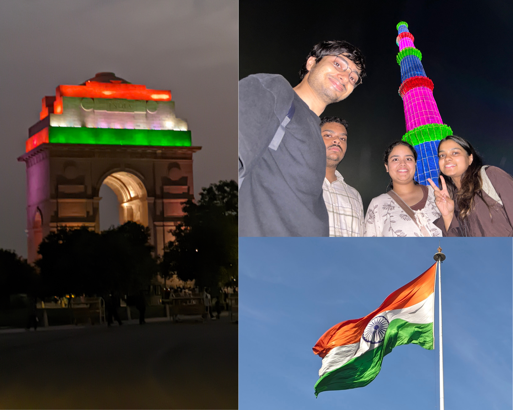
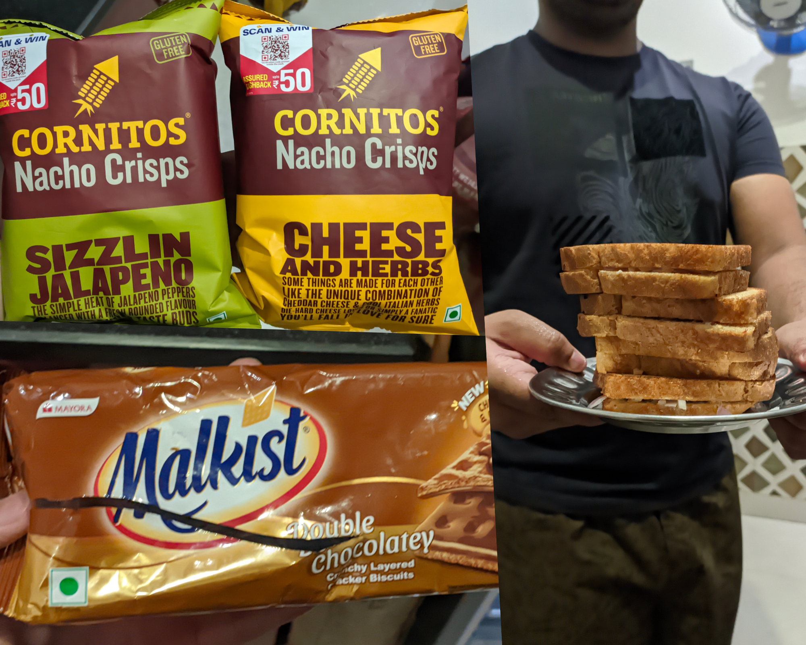
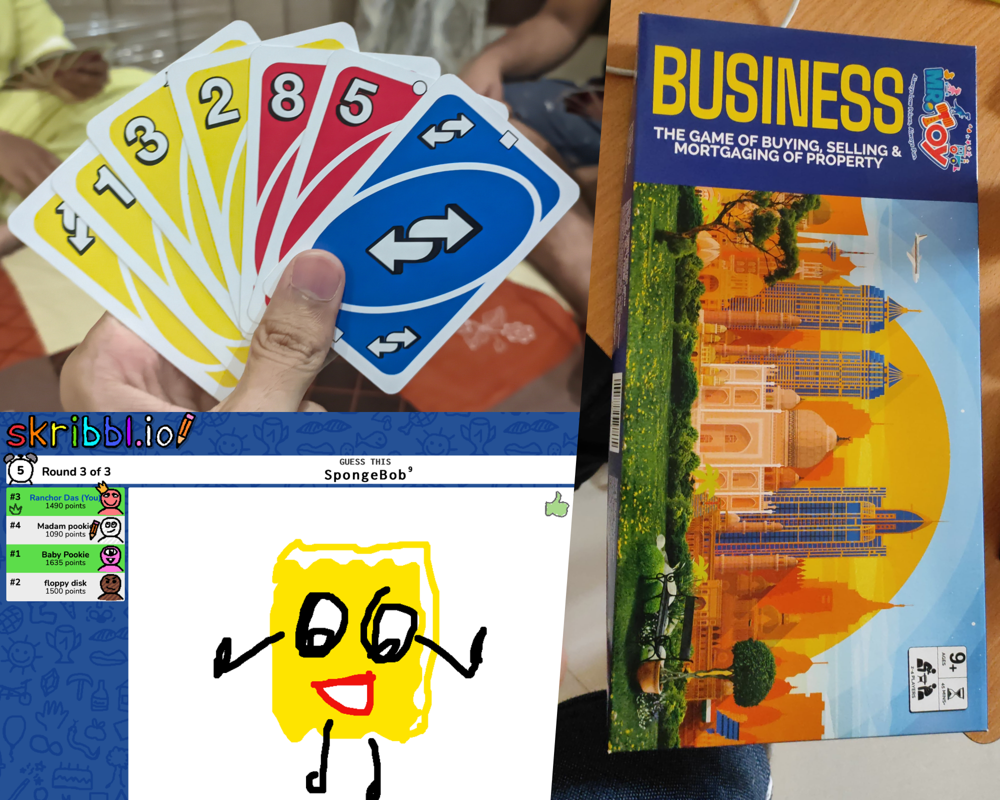

So here's how it all began. One day, completely out of nowhere, my phone started ringing, which felt kinda strange as I couldn't remember the last time anyone had actually called me. I rushed to check who it was, and to my surprise, it was one of my cousins reaching out. She told me that she was planning to come with her brother to spend their summer holidays in Delhi, and my first reaction was, "Are you sure that you can handle this heat? Even cleaning butts after a pooping session feels like hell". I wasn't even exaggerating - it was peak Delhi summer, with temperatures hitting 42 degrees for weeks with no sign of relief. But her reply was even banger than my warning, she said she'd rather die of heatstroke than of boredom. After listening to that, I was like DAMNN for a sec. By then I'd also finished my Master's exam, so was thrilled at the idea of some fun time with them.

Now, a little context - these cousins are my maternal uncle's (Mama's) kids, who'd only just turned old enough to vote. So even though we're technically all "Gen Z" but you can still feel the generational gap between us. This was also going to be their first solo trip, yeah without their parents and for comparison, I didn't get to travel alone for leisure until my early twenties, so these two kids were already beating my record. After some careful planning - and a few false promises to their parents for behaving well - they pulled it off, and our week-long trip officially began.

## Monuments

Delhi has a lot to offer, but for me, sightseeing the old monuments is always at the top of the list, and why wouldn't it be? Delhi was the capital for pretty much every ruler who ever fancied himself an emperor, and they all seemed to agree on one thing - send your best architects here, not the guy who flunked masonry classes back home. I checked internet to check where people seemed to enjoy visiting the most, and Qutub Minar came out on top. The last time I'd been there was probably back in my early teens, so I was excited to relive those memories. So we packed our bags with 2 liters of ORS and rushed to make it there before dusk to catch the light show. It took us 2 hrs to reach which turned out to be a bit dull for my cousins' taste - mostly because it focused on the monument's architectural history. Still, we snapped a few photos, and honestly, the highlight of the evening ended up being watching airplanes fly right over the tower. In my opinion - it wasn't as bad of a place but the temperature made the experience dull as we sweaty pigs needed mud to roll in, beautifully crafted monument was secondary. 

A bit disappointed after the first outing, I suggested India Gate for the next day - I call it my second home, as if i own a plot there. We headed out in the evening again, both to escape the heat and to catch the daily ceremony at the War Memorial - which honors the soldiers who gave their lives protecting India. It was actually my first time watching it too, and I found myself genuinely moved by it. Afterward, we wanted to sit on the grass near India Gate but to my surprise, officials had blocked people from sitting close to the monument now. That stung a little personally as some of my fondest memories of this place are of sitting quietly under the trees, just mesmerizing the beauty of the place. So instead, we walked a few hundred meters away and sat. We went child mode with an LED slingshot helicopter that we'd bought from there, competing over who could launch it highest while catching it earned you a bonus point as well, and I won. We also dared to play "Fire and Ice," a game that left all of us gasping for breath, especially my cousin, we bullied him by making him run all the way round to tag us to win. Evenings at India Gate are the prettiest, the walk in the center of Kartavya Path when low angled sunrays feels like a warm kiss to the face. 

Akshardham turned out to be our favorite by far - it is less of a religious site and more like a picnic spot. One cousin loved the food court, while the other couldn't stop talking about the boat ride. They take your phone and the belongings at the gate so the whole experience is full digital detox. The Temple has something to offer to everyone - even if you aren't religious, you can still appreciate the beautifully carved stone animals and the birdsong echoing from every corner of the architecture. While those who do come with faith, can connect with the story of Swaminarayan and bow their heads in reverence. The Museum inside is the best ever I have ever seen, you walk through those hyper-realistic dioramas that feels like watching live cinema while it covers heavy topics like peace, non-violence, humility - but the mode of telling is with stories rather than lecturing. The light-and-sound show was stunning even though we ended up mocking through most of the story, but by the end, even the skeptics among us felt something. It was actually my first time staying there till night and experiencing everything, and I was glad it happened with them.

## Food

One of my cousins is a serious foodie - honestly, half his reason for coming to Delhi was to try food chains that don't exist where he lives. Taco Bell and Popeyes topped his list, so I made sure our sightseeing plans revolved around his cravings too. We even redeemed my dad's credit card points for grocery vouchers, which basically gave us free rein to buy the most random snacks we could find. That's how I discovered things I never knew existed - like Milkist, a cracker biscuit whose double-chocolate flavor was ridiculously good, and Cornitos nachos, whose cheese-and-herbs flavor finally broke my lifelong dislike of nachos. I'm hooked enough that just writing about it makes me want to eat it again.

We also tried cooking at home, and somehow ended up filming all four of us just trying to toast a single burger bun - pure chaos, while blaming each other for getting the burnt taste at the end. Normally I keep a bit distance from sugary food, especially bread since it flares up my rosacea, but that whole week, I threw caution to the wind and ate whatever I wanted. My skin definitely paid the price later, but honestly, it felt worth it in the moment.

## Mystery Room

I'd known about escape rooms for a while, but they always felt like throwing too much money for something to try alone. With the cousins around, we finally had a full team of four. We picked the theme called "Prison Break", where two of us got handcuffed at the start while the other two had free hands, and then we were locked in for an hour to figure our way out. It's basically one giant puzzle that only works if you cooperate and find clues hidden in the props which can be anywhere inside the room, sometimes we had to match the pattern of the light bulb or to link the Alphabets in order to open the door - twisting and turning things to find a way to move forward in the game. And whenever we got stuck, we had four lifelines to take.

We didn't start off well, honestly it was the worst players to be in a team - siblings and cousins aren't exactly known for smooth teamwork, and given a chance, we'd rather bicker than collaborate. But somewhere along the way, we found our rhythm. We crawled through a pitch-black tunnel like toddlers to find a key, and climbed a wall to find the next clue. With the clock ticking down, we were kind of panicking, but the last few clues clicked so easily that we escaped with just minutes to spare. It felt surreal to me as this was something I used to watch on TV with my sister after school, never imagining I'd actually do it myself one day. All four of us walked out with medals with gold plated and took a photo to post which still hasn't been uploaded by them till the time of writing this. 

## Late Night Talks and Games

This part I loved the most - four of us crammed into one room, lights off, talking about everything from memes to family gossip about relatives we barely see anymore. Since both of them are still in school, some of the things that they casually mentioned would've felt mischievous if i had done back in my day. Kids really have leveled up, the things they know already were something I got way later in life, but really it was a lovely time listening to it.

We had already been planning our gaming sessions before the trip even started. One of my cousins is a compulsive gamer - ask him literally anything about games, and he'll have an answer. I enjoy games too, just not the competitive kind anymore as they stress me out more than to entertain me. We played Business (the Indian version of Monopoly), which has become our OG thing to play whenever we're all in one room. Though, I got financially wrecked while we played most of the nights, but it was a blast regardless. I like to think that I'm decent at Uno, since I've actually learnt strategies to win from Youtube, but the truth is, the game depends less on skill and more on who's sitting next to you. My sister knew every move I made, which was exactly why she won most of the rounds. We also played an online drawing-and-guessing game, and some of our worst drawings turned out to impossible to decipher yet so much fun pulling each other's legs for bad skill.

## Ending Note

Honestly, I loved playing the part of a host to my cousins - it felt like reliving my own childhood. I used to be a mischievous kid, always chasing the next prank just for the thrill of it, and I realized that part of me hasn't really changed with age. Watching their eyes light up over the smallest things reminded me how much I genuinely want the people I love to be happy. It's a strange comfort to feel your happiness being tied to someone important to you - making them smile brings me a kind of joy I can't quite explain.

Life has changed a lot and it wasn't used to feel this lonely, but somewhere along the way, that quiet cloud of loneliness crept in and settled. Moments like this trip are the ones that pull me back out of it and reminds me what it feels like to actually feel something. I never really told them the truth, that this trip was just as much a vacation for me as it was for them. By the end of it, I felt lighter - like a fresh leaf after the first monsoon shower.

