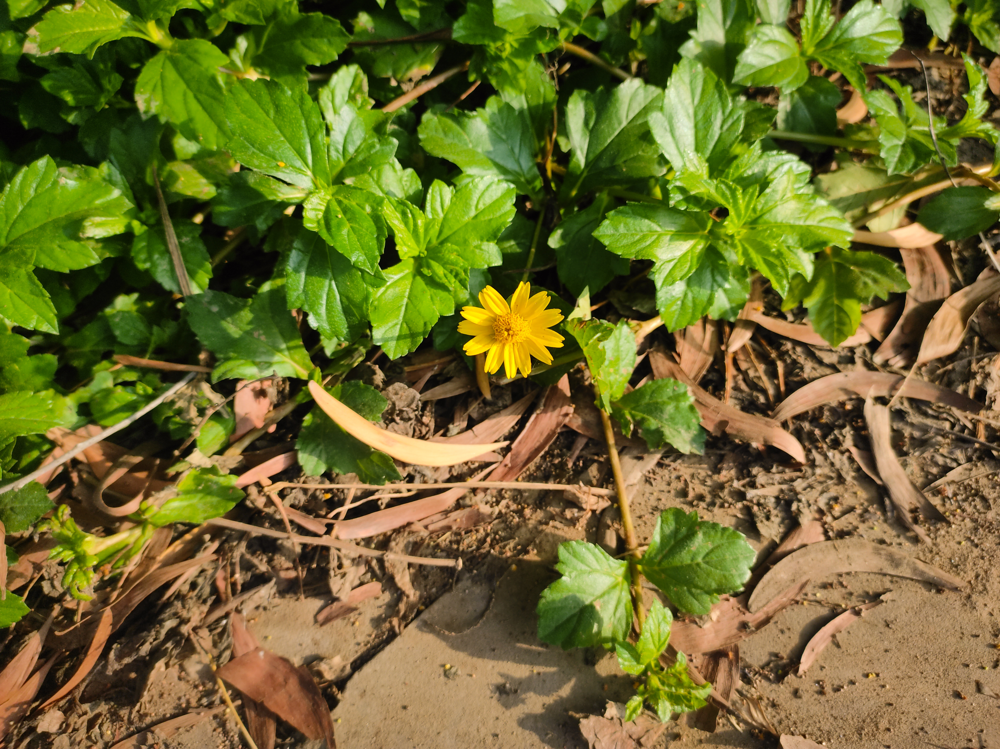

I woke up abruptly early in the morning with an uneasy feeling as my heart rate was a bit higher than normal, and it felt like there's something bothering me unconsciously. I tried to sleep again as it was still 2 hours before I naturally would wake up but no matter how many different ways I tried, I couldn't find myself able to calm so to sleep. After a while I gave up on the idea and just kind of called it a morning. I watched the sky shift from black to blue as morning painted itself in. I got a sudden urge to going to the park as I felt like I needed to walk so to calm myself down a bit so I tied up my shoelaces and went for it.

Life has been so uncanny lately, it's like I am in senses to know what's happening around me but still something I couldn't understand, and that must be the reason for the abrupt body response, as many times something we miss to register in the mind, the body tends to remember and gives signals time to time and it fascinates me whenever I miss the cues and get reminded later, as I thought that I could put reasoning to everything happening to me but I'm strangely realising that it's not the case always. 

When I reached the park, I was walking hastily as if I were rushing to be on time for something unknown which wasn't the case as I took this medium for calming my unnerving feeling but by then I realised something was off and then I felt the need to consciously take a pit stop. Here the park where I go regularly, is just so good as if the nature were showing off how charming it could be and it definitely managed to enchant me as If I had got attracted to a girl who seemed to possess all the qualities of beauty anyone could ask for. And as if the nature wanted to keep playing with my small heart, it introduced me with cute little ducks and I do not know how long I can keep my hands in pants and not jump to hold them. I sat near the fountain where there were less people as I demanded some privacy for my emotions and then I started processing everything was happening to me lately. I usually feel the need of have something in my hands or to be touched whenever I feel sort of anxiously thinking as If it helps me to focus a bit. As the process deepens, I found that there was a feeling of wanting something desperately, but I couldn't find a way to tell how to get it as if I were standing in a fog, and found someone out there but not in my reach.

Through these heaviness of feeling that I sat with, I saw a small girl approaching me with a smile as If I were her treat , the one she'd been looking for. And I felt like smiling too as it was the only logical thing I felt compelled to do in that moment. She was wearing a pink dress and her wobbly tiny steps towards me made me realise that she had recently learned how to walk as her steps weren't straight. I was sitting on a bench looking at her coming towards me and then I thought maybe she wanted to sit with me. She tried persistently to push her body up to the bench but couldn't as she was so tiny to do that and after one point I felt like offering my hand to help but I respected her dad who was vigilantly looking at her from a distance. She went back as was told that to go home but I felt she wanted to play play. I felt it was just a one off moments like in the past too, as kids did find me friendly to hang out with so I kinda ignored what happened and stepped back to my pensive state. But to my surprise I saw her again making her ways towards me, this time with the highest pace that her tiny legs could manage. She stopped right in front of to me to show her closed fist and i was perplexed trying to figure out her intention so i just tapped her with the leaf which i was holding in my left hand. She then turned slowly as if she'd learnt it from a movie, but to my surprise her hand was empty, there was nothing in there. I smiled genuinely and she saw my expressions and giggled too as If I had accepted her gift, I did though. And then she turned back, as if she knew her dad would get angry if she stayed here any more.

I couldn't understand for a second what had just happened to me, as I was just sitting on the bench being clueless and watching her slowly walking away from my site, my eyesight followed her till she was not visible anymore. I looked to my hand in which she tried to put something there and then after few eye blinks, I saw myself moved to tears. I felt she put "hope" in my hand which was invisible obviously as if she knew already what I was dealing with as I was losing my strength. I just felt like holding that feeling as if it was "a call" from a mystical place to what many affirms as a sign of God, for some it's just the destiny call or karma but for me it's a transcendent place that I can never perceive, neither process with my biological tools, and even worse can't talk about it as it's beyond linguistic capabilities but only to be felt at times. I've had a vague sense that this to exist somewhere and what the little girl did was to give me one another hope to find that place. To a human like me, maybe this ethereal feeling could be reduced to a quiet nudge to keep looking forward to build the place with utmost care and fill with love so to call it my home, and the nonphysical thing that girl left it in my hand was the hope to be brave for uncertainties and challenges that will come in the process of building it.

---
