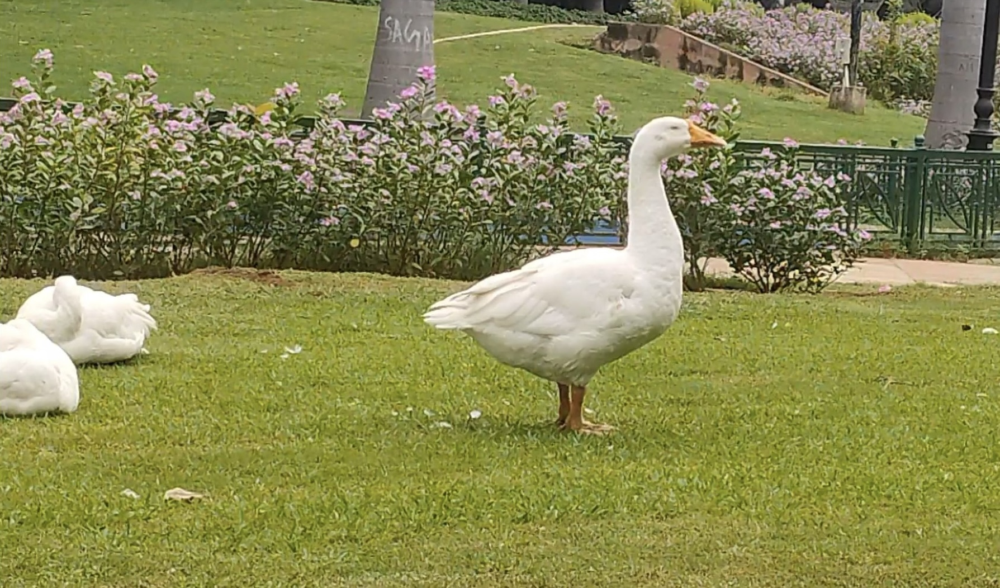

I woke up abruptly in the morning with an uneasy feeling as my heart rate was a bit higher than normal, and it felt like there's something bothering me unconsciously. I tried to sleep again as it was still 2 hours before I naturally would wake up but no matter how many different ways I tried, I couldn't find myself able to calm so to sleep. After a while I gave up on the idea and just kind of called it a morning. I watched the sky shift from black to blue as morning painted itself in. I got a sudden urge to going to the park as I felt like I needed to walk so to calm myself down a bit so I tied up my shoelaces and went for it.

Life has been so uncanny lately, it's like I am in senses to know what's happening around me but still something I couldn't understand, and that must be the reason for the abrupt body response, as many times something we miss to register in the mind, the body tends to remember and gives signals time to time and it fascinates me whenever I miss the cues and get reminded later, as I thought that I could put reasoning to everything happening to me but I'm strangely realising that it's not the case always. 

When I reached the park, I was walking hastily as if I were rushing to be on time for something unknown which wasn't the case as I took this medium to settle my nerves but by then I realised something was off so i took a conscious decision to take a pit stop. Here the park where I go regularly, is just so good as if the nature were showing off how charming it could be and it definitely managed to enchant me as If I had got attracted to a girl who seemed to possess all the qualities of beauty anyone could ask for. And as if the nature wanted to keep playing with my small heart, it introduced me with cute little ducks and I do not know how long I can keep my hands in pants and not jump to hold them. I sat near the fountain where there were less people as I demanded some privacy for my emotions so to start processing everything was happening to me lately. I usually feel the need of have something in my hands or to be touched whenever I feel sort of anxiously thinking about something just like a child clings to their mother sari for the comfort. As the process to know deepens, I found that there was a weird feeling of wanting something desperately, but I couldn't find a way to do it and more than that, I couldn't know what "it" was to even reach.

Through these heaviness of feeling that I sat with, I saw a small girl approaching me with a smile as If I looked like the treat she'd been asking for. And I felt like smiling as it was the only logical thing to do in that moment. She was wearing a cute pink dress and her wobbly tiny steps made me realise that she had recently learned to walk as she couldn't manage to balance her body properly. I was sitting on a bench looking at her coming towards me and then I thought maybe she just wanted to sit next to me so i shifted to the corner to give ample space to do her things. Though she tried persistently to push herself up to the bench but couldn't as her tiny body couldn't manage to do that. At one point I felt like offering my hand to help but I respected her dad who was vigilantly watching her from a distance. She turned and went slowly towards her dad as if was told to go home but I felt she just wanted a little more time to play. I thought it was just a one-off moment like happened in the past too, as kids do find me friendly to hang out with so I kinda ignored what happened then and stepped back to my pensive state. But to my surprise I saw her again making her ways towards me, this time with the highest pace that her tiny legs could manage. She stopped right in front of me to show her closed fist. By then I was kind of perplexed trying to figure out her intention so i just tapped her with the leaf which i was holding in my left hand. She then turned her hand slowly as if she'd learnt it from a movie, but to my surprise her hand was empty, there was nothing in there. I smiled genuinely, while she was observing me, giggled too like I had accepted her gift, which I did though. And then she turned back, as if she knew her dad would get angry if she stayed here any more.

I couldn't understand for a second what had just happened with me, as I was sitting on the bench being clueless and watching her slowly walking away from my sight, my eyes followed her until she was no longer visible. I looked at my hand, in which she had tried to put something, and then after few eye blinks, I found myself moved to tears. I felt she'd put "hope" in my hand, which was invisible obviously, as if she knew already what I was dealing with and understanding that I was losing my strength. I just felt like pausing the time to hold onto that feeling as it felt like a supernatural moment had just passed as if it were "a call" from a mystical place to remind me something, to what many affirm as a sign from God, for some it's just destiny or karma but for me it was coming from a transcendent place that I can never perceive, nor process with my biological tools, and even worse can't talk about it as it's beyond linguistic capabilities, but only to be felt at times. I've had a vague sense that, this place exists somewhere and what the little girl did, was to give me one another hope to find that place. To a human like me, maybe this ethereal feeling could be reduced to a quiet nudge to keep looking forward to build that place with utmost care and fill it with love so to call it my home, and the nonphysical thing that girl left it in my hand was the hope to be brave for uncertainties and challenges that will come in the process of building it.

::youtube{url="https://www.youtube.com/watch?v=FK5VulNn3so"}

